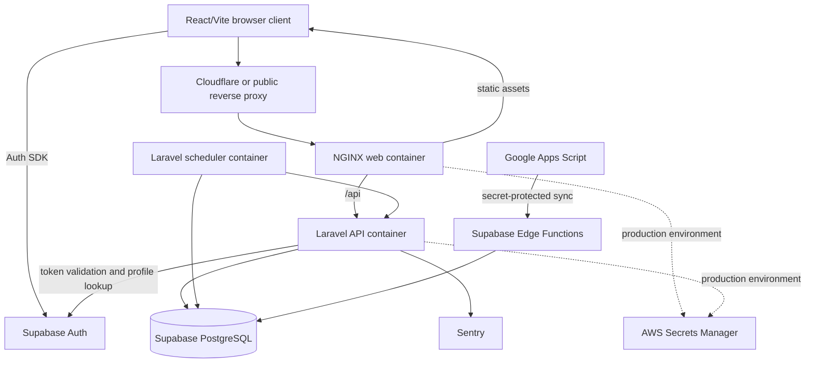
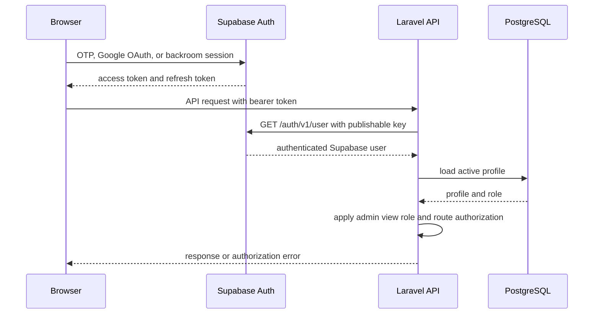
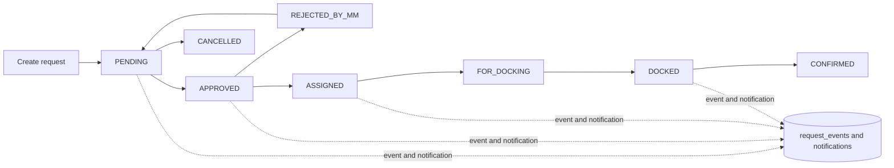

# SOC5 Outbound System Design Baseline

## Scope

This document records the Phase 0 architecture baseline for the SOC5 Outbound
system. It describes the current implementation and establishes measurement
priorities for later changes. It does not authorize new infrastructure or
application behavior changes.

The baseline was produced from the Code Review Graph and targeted inspection of
the frontend, Laravel API, Supabase functions and migrations, Docker Compose,
CI, and production deployment scripts.

## Current Architecture

SOC5 Outbound is a modular monolith with a React browser client and a Laravel
API. Supabase provides PostgreSQL and authentication. Supabase Edge Functions
receive authenticated-by-secret synchronization requests from Google Apps
Script and write operational data to PostgreSQL. A Laravel scheduler runs
periodic synchronization and maintenance commands.

### Runtime components

| Component | Responsibility | Observed implementation |
| --- | --- | --- |
| React/Vite | Authentication UI, routing, dashboards, request workflows | `frontend/` |
| Supabase Auth | FTE OTP/Google login and session management | Browser Supabase client |
| Laravel API | Authorization, validation, request state transitions, reads/writes | `backend/` |
| Supabase PostgreSQL | Profiles, requests, events, notifications, clusters, intraday data | `supabase/migrations/` |
| Edge Functions | Batch ingestion for clusters and intraday dispatch | `supabase/functions/` |
| Scheduler | Google Sheets sync, idempotency pruning, audit retry | Laravel `schedule:work` |
| NGINX | Static asset serving and API reverse proxy | Docker deployment |
| Sentry | Exception reporting | Laravel and React integrations |
| GitLab CI | Frontend, backend, edge-function, and deployment-config checks | `.gitlab-ci.yml` |

No `appwrite/` directory is present in the inspected checkout. Existing
Appwrite migration compatibility must therefore be treated as a protected
external or historical integration surface until its implementation is located.

## Module Boundaries

### Frontend

- `frontend/src/App.tsx` owns startup state, Supabase auth events, profile
  resolution, and transitions between signed-out, unauthorized, password-change,
  and ready states.
- `frontend/src/pages/Login.tsx` owns FTE OTP/Google login and backroom login.
- `frontend/src/pages/Dashboard.tsx` owns authenticated shell navigation and
  role-based view selection.
- Dashboard views include overview, outbound requests, midmile requests,
  docking confirmation, KPI, and user management.
- `frontend/src/lib/api.ts` is the shared API client. It attaches the Supabase
  bearer token and the optional admin view-role header.
- TanStack Query manages dashboard and request read caching/refetch behavior;
  Zustand stores UI state such as date filters and view role.

### Backend

The Laravel API follows controller -> service -> repository boundaries in the
main feature areas:

- `Auth`: Supabase authentication middleware and backroom session operations.
- `Requests`: validation, authorization, state transitions, event creation,
  notifications, pagination, metrics, and analytics.
- `Users`: user administration and access requests.
- `Notifications`: role/user-targeted notifications and read receipts.
- `Kpi` and `Dispatch`: operational reporting and intraday data reads.

Controllers validate HTTP input. Services enforce business workflows and
transactions. Repositories perform persistence and read queries.

### Data synchronization

- `sync-clusters` validates and deduplicates up to 1,000 rows, then upserts by
  `cluster_name`.
- `sync-intraday` validates and aggregates rows by `dispatch_date` and `hour`,
  then upserts the normalized rows.
- Both functions use a source allow-list and shared-secret header. They disable
  Supabase JWT verification in configuration because they implement their own
  source authentication.

## Authentication and Authorization Flow

Observed safeguards:

- Browser uses only the Supabase publishable/anon key.
- Laravel checks the bearer token through Supabase Auth.
- Laravel loads an active profile before protected access.
- Role and transition authorization remains in backend code.
- Admin role switching is accepted only for an allow-listed set of roles.
- Supabase calls have a 5-second connect timeout and 10-second request timeout.
- Validated token identity is cached for 30 seconds by default.
- Authentication and API requests have IP and API throttles.
- Password-change-required accounts are restricted to the profile and password
  change endpoints.

## Request Lifecycle

Request mutations use database transactions. The request row, event row, and
notifications are written as one logical operation. Create, update, and action
routes use idempotency middleware where configured. Bulk approval executes
multiple transitions inside a transaction.

## Read and Write Paths

### Dashboard reads

The overview view currently issues four independent authenticated reads:

1. `/requests?per_page=100...`
2. `/requests/metrics`
3. `/requests/analytics`
4. `/dispatch/intraday`

These queries refetch every 15 seconds while the overview is active. Metric,
analytics, and intraday query keys include date inputs where applicable. Detail
requests are issued when an operator selects a status card.

This is an observed request-volume characteristic, not yet a proven bottleneck.
Phase 1 should measure latency, database time, result sizes, and concurrent
request volume before consolidating endpoints or introducing caching.

### Request writes

The API validates payloads, checks actor permissions and legal state
transitions, locks the request row, updates the request, and appends events and
notifications inside a transaction. External work is not currently required to
complete the core request transition.

### External synchronization

The Edge Functions accept bounded batches and reject malformed, unauthorized,
or oversized input. Upserts make repeated synchronization safer, but sync
latency, failure rates, and retry behavior are not yet measured in this
baseline.

## Database Design Baseline

The migration history includes schema hardening, role policies, reporting and
scalability indexes, notification read receipts, idempotency keys, and user
event retry state. PostgreSQL remains the source of truth.

Current design principles:

- UUID identifiers for application entities.
- Explicit column selection in important reads.
- Pagination limits on request listings.
- Composite indexes for request reporting and queue access.
- Database transactions around request state changes.
- Unique/upsert keys for synchronized cluster and intraday data.
- RLS and backend authorization remain separate controls.

The baseline does not justify replicas, partitioning, sharding, or a separate
read model. Those decisions require query plans, table sizes, write rates, and
production workload evidence.

## Deployment and Operations

Docker Compose runs:

- `web`: frontend image and NGINX on the public port.
- `api`: Laravel API with a container health check.
- `scheduler`: Laravel `schedule:work` using the API image.

Production deployment:

1. Loads root and backend environment files from AWS Secrets Manager.
2. Verifies required authentication and application variables.
3. Fetches the selected revision.
4. Validates Compose configuration and builds images.
5. Applies Laravel migrations.
6. Verifies production configuration.
7. Starts containers and waits for API health.
8. Checks authentication readiness and scheduler health.
9. Waits for the public health endpoint.

GitLab CI currently validates frontend source/encoding/robots rules, lint,
accessibility, formatting, unit tests, Playwright tests, and builds. Backend
jobs run Pint and SQLite tests, with a separate PostgreSQL test job. Edge
functions run Deno type checks and tests. Deployment configuration validates
shell syntax, migration ordering, production config verification, and the
scheduler declaration.

## Evidence and Measurement Gaps

The graph contains 239 files, 996 nodes, and 8,605 edges. It identifies a
request-heavy frontend community, Laravel request communities, and migration/
event code. It also reports 20 untested hotspots, mainly high-degree frontend
pages and components. Some call edges remain unresolved because the graph has
limited language binding information; graph results should support, not replace,
source and runtime validation.

The following measurements are not currently available in the repository
baseline:

- Endpoint p50/p95/p99 latency and database time.
- Query plans and row counts for request metrics and analytics.
- Dashboard request volume per active operator.
- Supabase Auth latency and failure rate.
- Edge Function ingestion volume, duration, and error rate.
- Queue/scheduler duration and failure history.
- Table growth and event/notification retention.
- Bundle size and browser render/refetch cost in production.

## Phase 1 Measurement Plan

Instrument or collect evidence for the following, in order:

1. Add request correlation IDs and structured timing for Laravel requests,
   excluding credentials and tokens.
2. Capture endpoint duration, status, authenticated role, and database query
   timing for the dashboard and request workflow endpoints.
3. Record external dependency latency and failure categories for Supabase Auth,
   Google Sheets synchronization, and Edge Functions.
4. Inspect PostgreSQL query plans and index usage for request listing, metrics,
   analytics, and dispatch queries.
5. Measure frontend bundle size and dashboard network/refetch behavior.
6. Use Sentry to correlate exceptions with endpoint and dependency timings.

Phase 1 should produce a short evidence report before any caching, queue,
read-model, real-time transport, or infrastructure changes are proposed.

## Architectural Decisions and Constraints

- Keep the modular monolith until independent scaling or ownership is proven.
- Keep PostgreSQL authoritative; caches may only optimize measured hot reads.
- Use queues only for slow, independent, retryable, or resource-intensive work.
- Prefer polling while dashboard freshness requirements are satisfied by it.
- Add retries only for classified transient failures and define idempotency first.
- Preserve Supabase authentication, role authorization, API contracts, database
  migrations, Sentry integration, and existing CI/CD behavior.
- Do not add Redis, Kafka, RabbitMQ, Kubernetes, replicas, CQRS, WebSockets, or
  partitioning without workload evidence and a focused decision record.

## Risks and Technical Debt

- The dashboard's four-query 15-second polling pattern may create avoidable
  load as concurrent operators increase; this is unmeasured.
- The dashboard request preview fetches up to 100 rows and may grow in cost as
  request volume increases; pagination and query plans need verification.
- Frontend high-degree components have limited direct test coverage according
  to the graph and should be prioritized when behavior changes.
- Scheduler health is checked at deployment, but ongoing job duration and
  failure visibility should be measured.
- The current graph has unresolved call edges and no semantic embeddings, so
  architecture analysis must be complemented by runtime evidence.

## Rollback Strategy

This Phase 0 change is documentation-only. Rollback is deleting the baseline
file or reverting its commit. No runtime, schema, authentication, deployment,
or API behavior is changed.
